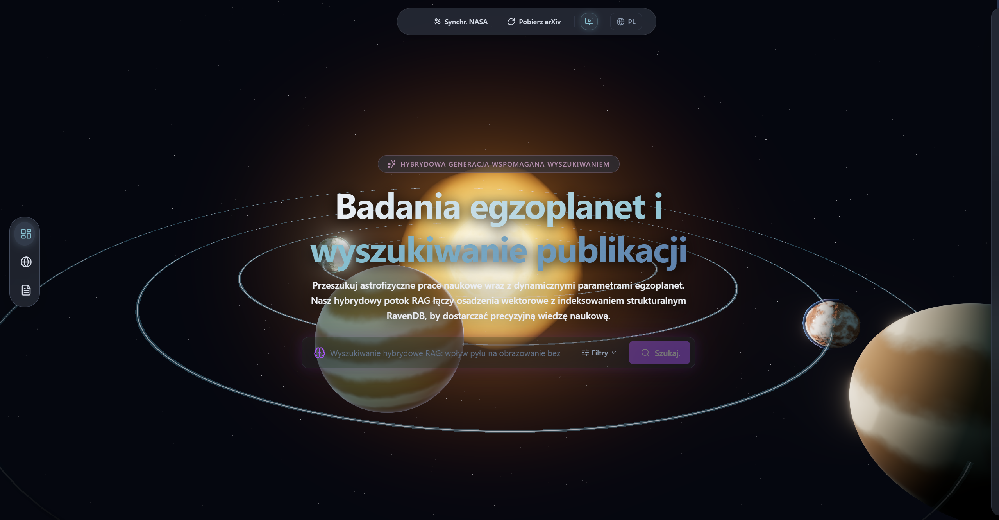
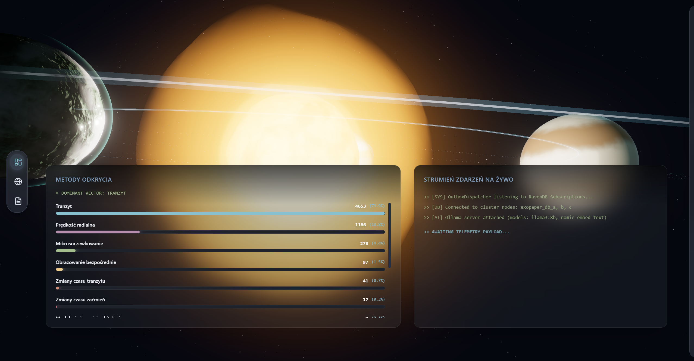
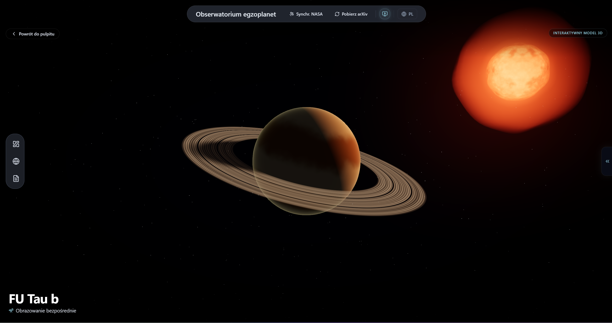
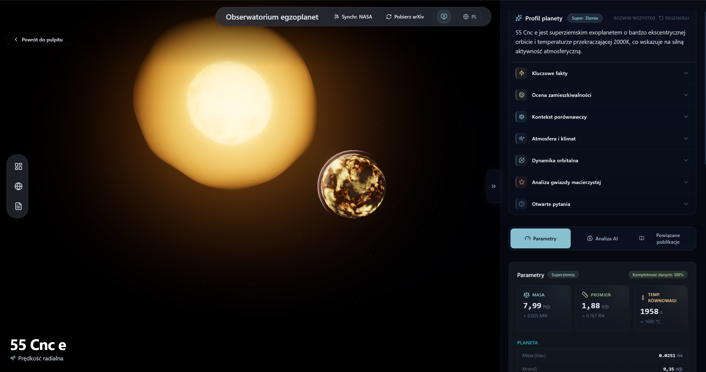
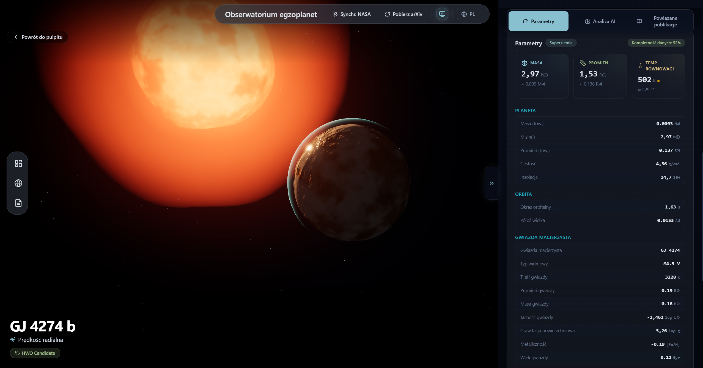
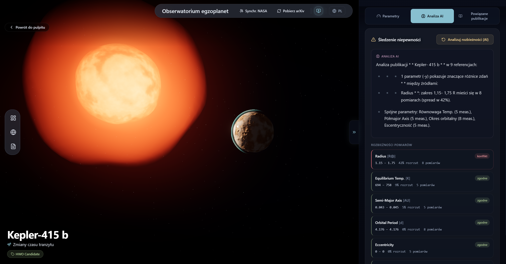
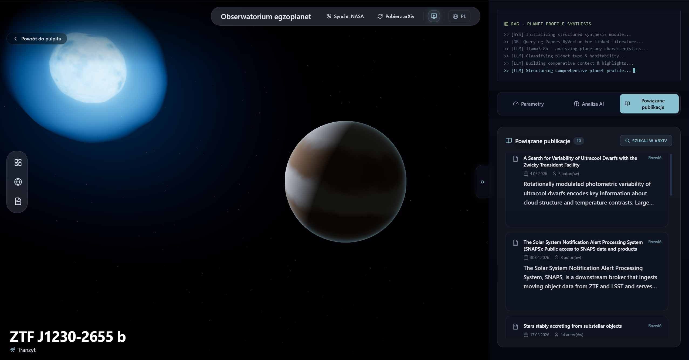
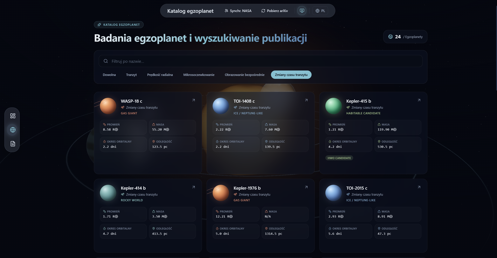
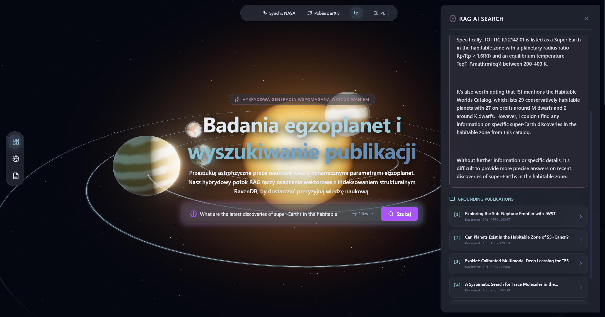

# ExoPaper — Exoplanet Observatory & Research Platform

ExoPaper is a full-stack scientific platform for exploring confirmed exoplanets and the
literature about them. It continuously ingests the **NASA Exoplanet Archive** and **arXiv**,
vectorizes paper text for **Retrieval-Augmented Generation (RAG)**, generates structured
AI "planet profiles" with a **local LLM (Ollama)**, tracks measurement uncertainty across
publications, and renders every planet as a **physically-driven, procedurally-generated 3D
world** in the browser.

The application is bilingual (English / Polish) with on-the-fly translation, real-time
updates over SignalR, and a cinematic React Three Fiber front end.

<!-- Replace with a real banner / hero screenshot (recommended: 1600×800) -->



---

## Table of Contents

1. [Key Features](#key-features)
2. [Screenshots](#screenshots)
3. [Architecture](#architecture)
3. [Technology Stack](#technology-stack)
4. [Data Sources & Pipeline](#data-sources--pipeline)
5. [Domain Model](#domain-model)
6. [Backend Subsystems](#backend-subsystems)
7. [3D Rendering Engine](#3d-rendering-engine)
8. [Frontend Architecture](#frontend-architecture)
9. [API Surface](#api-surface)
10. [Project Structure](#project-structure)
11. [Running the Project](#running-the-project)
12. [Configuration](#configuration)
13. [Performance & Optimization](#performance--optimization)

---

## Key Features

- **Automated catalog ingestion** — Daily sync of ~6,300 confirmed planets from the NASA
  Exoplanet Archive (TAP/ADQL), with ~40 scientific parameters per planet and cross-fill
  from the per-publication `ps` table when the composite table is sparse.
- **Literature harvesting** — Bulk arXiv OAI-PMH harvesting (filtered to `astro-ph.EP`) plus
  **on-demand, per-planet targeted search** by name and aliases for sparsely-studied worlds.
- **RAG over papers** — Full paper text is fetched, chunked, embedded (`nomic-embed-text`),
  stored as standalone chunk documents, and indexed for **Corax vector search** in RavenDB.
- **AI Planet Profile** — A local LLM generates a structured, 10-section profile (highlights,
  habitability, comparative context, atmosphere, orbital dynamics, host star, literature,
  open questions) grounded in catalog parameters + literature, with a deterministic
  parameter-only fallback so the panel never fails.
- **Uncertainty / discrepancy tracking** — Pulls every published measurement (with error
  bars) of a planet's parameters from NASA's `ps` table and computes per-parameter spread,
  flagging genuine cross-publication disagreements — fully data-driven (no LLM dependency).
- **Conversational RAG** — Ask questions about a planet; vector search is scoped to that
  planet's linked papers, then the LLM streams a grounded, cited answer over SignalR.
- **Procedural 3D worlds** — Each planet is rendered with GPU-generated PBR textures whose
  appearance is **driven by the planet's real physics** (temperature → lava / temperate /
  ice palettes), with volumetric atmospheres, gas-giant bands, Saturn-style rings, and star
  shaders.
- **Bilingual UI** — English/Polish interface with automatic background translation of
  AI-generated text via a local LibreTranslate container.
- **Real-time telemetry** — SignalR pushes embedding/tagging events to a live dashboard using
  the transactional outbox pattern.

---

## Screenshots

### Dashboard
Live metrics, discovery-method analytics and the pipeline-coverage widget over an animated
cosmic background.



### Planet Detail — 3D Model
Procedurally generated, physics-driven planet with atmosphere, rings and a shader-based star.



### AI Planet Profile
Structured, multi-section AI profile (auto-translated to Polish) generated from catalog data
and literature.



### Parameters
Spec sheet with hero metrics, human-relatable conversions and grouped scientific parameters.



### Uncertainty Tracking
Data-driven cross-publication discrepancy analysis from NASA `ps` measurements.



### Linked Publications & RAG Search
Linked papers with on-demand arXiv search and conversational, citation-grounded RAG answers.



| | |
|---|---|
|  |  |
| _Exoplanet catalog with filters_ | _Streamed RAG answer with sources_ |

---

## Architecture

### High-level system

```
┌──────────────────────────────────────────────────────────────────────────┐
│  Browser (React 19 + React Three Fiber)                                   │
│   • 3D canvas (z-0)  ↔  Zustand store  ↔  Glassmorphic DOM overlay (z-10) │
│   • SignalR client  •  i18n (en/pl)  •  LibreTranslate auto-translate     │
└───────────────┬───────────────────────────────────────────┬──────────────┘
                │ HTTP /api  ·  WebSocket /hubs               │ /api/translate
                ▼                                             ▼
┌──────────────────────────────────────┐        ┌──────────────────────────┐
│  nginx (reverse proxy)               │        │  LibreTranslate (en↔pl)  │
└───────────────┬──────────────────────┘        └──────────────────────────┘
                ▼
┌──────────────────────────────────────────────────────────────────────────┐
│  ASP.NET Core 9 API  ·  Clean Architecture (CQRS via MediatR)             │
│   Api → Application → Infrastructure → Domain                              │
│   • Controllers (thin)        • Hosted workers (subscriptions)            │
│   • SignalR Hub               • Quartz.NET scheduled jobs                 │
└───────┬───────────────────────────┬──────────────────────────┬───────────┘
        ▼                           ▼                          ▼
┌────────────────┐        ┌──────────────────┐       ┌────────────────────┐
│ RavenDB cluster│        │ Ollama (LLM)     │       │ NASA TAP / arXiv   │
│ (Corax vectors)│        │ llama3.2:3b +    │       │ (external sources) │
│ 3 nodes        │        │ nomic-embed-text │       │                    │
└────────────────┘        └──────────────────┘       └────────────────────┘
```

### Backend — Clean Architecture (CQRS)

| Layer | Responsibility | Examples |
|-------|----------------|----------|
| **Domain** | Pure business entities & rules, no dependencies | `Exoplanet`, `Paper`, `PaperChunk`, `ParameterMeasurement`, unit derivation, HWO-candidate rule |
| **Application** | Use-cases (MediatR queries/commands), abstractions | `GetPlanetAiSummaryQuery`, `AskExoplanetQuery`, `GetUncertaintySummaryQuery`, `IOllamaClient`, `IExoplanetMeasurementSource` |
| **Infrastructure** | External integrations & implementations | RavenDB, `NasaClient`, `ArxivClient`, `OllamaClient`, Quartz jobs, hosted workers, indexes |
| **Api** | HTTP/SignalR transport, DI composition | Controllers, `ExoPaperHub`, `Program.cs` |

The **canvas boundary is never crossed by props** on the front end: DOM React and Canvas
React communicate only through the Zustand store (`getState()` inside the render loop,
selectors in the DOM).

---

## Technology Stack

### Backend
- **.NET 9 / ASP.NET Core** — Web API + SignalR
- **RavenDB 7.2** (3-node cluster) — document database with the **Corax** search engine for
  native **vector (HNSW) search**
- **MediatR** — CQRS request/handler pipeline
- **Quartz.NET** — scheduled background jobs (NASA sync, arXiv harvest)
- **Polly** — HTTP resilience (retry, circuit breaker, flow-control handling)
- **HtmlAgilityPack** — full-text extraction from arXiv HTML
- **Ollama** — local LLM runtime: `llama3.2:3b` (generation) + `nomic-embed-text` (embeddings)

### Frontend
- **React 19 + TypeScript + Vite**
- **React Three Fiber / three.js / @react-three/drei / @react-three/postprocessing** — 3D scene, custom GLSL shaders, bloom/SMAA/tone-mapping
- **Zustand** — state bridging DOM ↔ WebGL canvas
- **Tailwind CSS v4** — Nord-palette glassmorphic design system
- **Framer Motion** — UI animation
- **@microsoft/signalr** — real-time client
- **axios** — REST client

### Infrastructure
- **Docker Compose** — RavenDB cluster, Ollama (GPU-enabled), LibreTranslate, API, UI/nginx
- **nginx** — serves the SPA and reverse-proxies `/api`, `/hubs`, `/api/translate`
- **LibreTranslate** — self-hosted en↔pl machine translation

---

## Data Sources & Pipeline

### NASA Exoplanet Archive (TAP / ADQL)
- **`pscomppars`** (composite parameters) — primary catalog: ~40 columns per planet
  (mass, radius, orbit, equilibrium temperature, insolation, host-star parameters, discovery
  metadata, coordinates, magnitudes, aliases, …).
- **`ps`** (per-publication parameters) — used for **cross-fill** of missing values and for
  **uncertainty tracking** (each row = one publication, with `err1/err2` error bars).
- `NasaSyncJob` performs a full seed on first run and **incremental sync** (`releasedate >`
  last sync) thereafter.

### arXiv
- **OAI-PMH** (`ListRecords`) — bulk harvesting filtered to the `astro-ph.EP` category, with
  flow-control (HTTP 503 + `Retry-After`) handling and resumption-token pagination.
- **Search API** (Atom) — targeted, on-demand per-planet search using the planet's name and
  aliases, linking results directly to the planet.

### Ingestion → RAG flow

```
NASA TAP ──► NasaSyncJob ──► Exoplanet docs
arXiv    ──► Harvester    ──► Paper docs (HasEmbeddings=false)
                                  │
                  RavenDB Data Subscription
                                  ▼
                         EmbeddingWorker
              (fetch HTML → chunk → embed via Ollama)
                                  ▼
                    PaperChunk docs (separate)  ──►  Papers_ByVector (Corax)
                                  ▼
              PaperLinkingWorker (gazetteer entity linking)
                                  ▼
                         OutboxEvent ──► SignalR ──► live UI
```

---

## Domain Model

| Entity | Purpose |
|--------|---------|
| `Exoplanet` | ~40 scientific fields, derived values (Earth↔Jupiter units, estimated T_eq), tags, completeness, cached AI summaries |
| `Paper` | Title, abstract, authors, linked exoplanet ids, `ChunkCount`, embedding state |
| `PaperChunk` | **Standalone** document (`PaperChunks/{arxivId}/{i}`) holding chunk text + embedding vector — kept out of `Paper` so documents don't exceed RavenDB's 5 MB limit |
| `Author` | Author entity (Include-friendly relation) |
| `ParameterMeasurement` / `ParameterDisparity` | Per-publication measurements & computed cross-publication spread |
| `SyncTracker` | Per-provider sync state (NASA, arXiv) |
| `OutboxEvent` | Transactional outbox for real-time notifications |

### Indexes
- **`Papers_ByVector`** — Corax vector index mapping `PaperChunk` documents; uses
  `LoadDocument<Paper>` so the planet filter stays correct even when a paper is linked after
  embedding. Stores `PaperId`/`Text`/`ChunkIndex` so retrieval projects results **without
  loading the large source document**.
- **`Papers_ByAbstractSearch`** — full-text search over abstracts.
- **`Exoplanets_ByHabitability`**, **`Exoplanets_StatsByDiscoveryMethod`** — map/reduce
  analytics for the dashboard.

---

## Backend Subsystems

### Hosted services (run for the app's lifetime)
- **`RavenInitializer`** — bootstraps the RavenDB cluster out of "passive" state, adds nodes,
  creates the database with the right replication factor, and deploys all indexes.
- **`OllamaWarmupService`** — preloads the generation model so the first request is fast.
- **`EmbeddingWorker`** — consumes a RavenDB Data Subscription of un-embedded papers, fetches
  full text, chunks it, embeds each chunk, and stores chunk documents.
- **`PaperLinkingWorker`** — entity-links papers to planets via an `ExoplanetGazetteer`.
- **`TaggingWorker`** — applies tagging rules (e.g. *HWO Candidate*).
- **`OutboxDispatcher` / `OutboxCleanupService`** — deliver and prune real-time events.

### Scheduled jobs (Quartz.NET)
- **`NasaSyncJob`** — daily catalog sync (full seed / incremental).
- **`ArxivHarvesterJob`** — daily bulk arXiv harvest.
- **`TargetedHarvesterJob`** — continuous per-planet arXiv backfill.

### AI subsystems
- **Planet Profile** (`GetPlanetAiSummaryQueryHandler`) — builds a parameter + literature
  prompt, requests a strict JSON schema, parses it into sections, caches the result, and
  falls back to a deterministic parameter profile if the model misbehaves.
- **Uncertainty** (`GetUncertaintySummaryQueryHandler`) — deterministic spread analysis over
  `ps` measurements.
- **Ask** (`AskExoplanetQueryHandler`) — planet-scoped vector retrieval + streamed LLM answer.

---

## 3D Rendering Engine

Every planet is generated procedurally — no static assets, fully seeded for determinism.

- **GPU procedural textures** — albedo / normal / roughness (and an emissive *lava* map) are
  rendered to off-screen targets via custom GLSL, cached in a ref-counted LRU pool.
- **Physics-driven appearance** — equilibrium temperature (or orbital distance when missing)
  selects the climate archetype: lava → desert → temperate (oceans) → ice; gas giants are
  tinted hot-Jupiter / Jovian / ice-giant accordingly.
- **Atmospheres** — limb-only Rayleigh + Mie scattering shader (wavelength-biased, climate
  tinted, sunset terminator).
- **Rings** — procedural banded ring system with Cassini gaps and a cylindrical planet shadow,
  reserved for true giants.
- **Stars** — animated granulation/sunspot/corona shaders with temperature-based color and
  a single shadow-casting light.
- **Post-processing** — lazy-loaded EffectComposer (Bloom, SMAA, Vignette, ACES tone mapping).

---

## Frontend Architecture

Three coupled layers communicating only through Zustand:

1. **3D scene** (R3F) — `ExoplanetScene`, `CosmicHero`, `PlanetMesh`, `StarMesh`, shaders.
2. **State & real-time** — Zustand store + SignalR hook (`withAutomaticReconnect`).
3. **UI overlay** — Nord-palette glassmorphic panels, Framer Motion, Lucide icons.

Notable UI: interactive **Planet Profile accordion** (auto-translated to Polish), **parameter
spec sheet** with hero tiles and human-relatable conversions, **uncertainty disparity** cards,
**linked publications** with on-demand arXiv search, and a **pipeline-coverage** dashboard
widget.

---

## API Surface

| Method & Route | Purpose |
|----------------|---------|
| `GET /api/exoplanets` | Paginated, filterable planet list |
| `GET /api/exoplanets/by-id?id=` | Single planet |
| `GET /api/exoplanets/habitable` | Habitable-zone planets |
| `GET /api/exoplanets/stats` | Discovery-method statistics (map/reduce) |
| `GET /api/exoplanets/hwo-count` | HWO candidate count |
| `GET /api/exoplanets/summary?id=` | AI planet profile (cached) |
| `GET /api/exoplanets/uncertainty?id=` | Data-driven discrepancy analysis |
| `POST /api/exoplanets/harvest?id=` | On-demand targeted arXiv harvest |
| `GET /api/papers/search` · `by-exoplanet` · `{id}` | Paper search / linkage / detail |
| `POST /api/papers/search/hybrid` | Hybrid (vector + full-text) search |
| `GET /api/sync/status` · `health` | Provider sync status / pipeline coverage |
| `POST /api/sync/nasa` · `arxiv` | Trigger ingestion jobs |
| `POST /api/translate` | Proxied to LibreTranslate (en↔pl) |
| `WS /hubs/exopaper` | SignalR — real-time events & streamed RAG answers |

---

## Project Structure

```
ExoPaper/
├── ExoPaperRAG.Domain/          # Entities, rules, derivation (no dependencies)
├── ExoPaperRAG.Application/     # MediatR use-cases, abstractions, indexes, contracts
├── ExoPaperRAG.Infrastructure/  # RavenDB, NASA/arXiv/Ollama clients, jobs, workers
├── ExoPaperRAG.Api/             # Controllers, SignalR hub, DI composition (Program.cs)
├── ExoPaperRAG.Tests/           # Unit tests (domain rules)
├── ExoPaper.UI/                 # React + R3F front end (Vite), nginx.conf
└── docker-compose.yml           # RavenDB cluster, Ollama, LibreTranslate, API, UI
```

---

## Running the Project

### Prerequisites
- Docker Desktop (allocate **16 GB+ RAM** — the LLM, RavenDB cluster and translator are
  memory-hungry)
- Optional: NVIDIA Container Toolkit for GPU-accelerated LLM inference (≈10–50× faster)

### Start everything
```bash
docker compose up --build -d
```

On first boot the stack will:
1. Bootstrap the RavenDB cluster and create the `ExoPaper` database + indexes.
2. Pull the Ollama models (`llama3.2:3b`, `nomic-embed-text`).
3. Load the LibreTranslate en/pl models.

Then trigger the initial data load (UI buttons or):
```bash
curl -X POST http://localhost:5000/api/sync/nasa     # seed planets
curl -X POST http://localhost:5000/api/sync/arxiv    # harvest papers
```

| Service | URL |
|---------|-----|
| Web UI | http://localhost:3000 |
| API | http://localhost:5000 |
| RavenDB Studio | http://localhost:8080 |
| LibreTranslate | http://localhost:5500 |

### Local development
```bash
# Backend
dotnet run --project ExoPaperRAG.Api
# Frontend (Vite dev server with /api & /hubs proxy)
cd ExoPaper.UI && npm install && npm run dev
```

---

## Configuration

Key settings (`appsettings.json` / environment variables, `__`-delimited):

- `RavenSettings__Urls__*`, `RavenSettings__DatabaseName`
- `OllamaSettings__GenerationModel` (default `llama3.2:3b`), `EmbeddingModel`,
  `MaxGenerationTokens`, `ContextWindowTokens`, `GenerationTimeoutMinutes`, `KeepAliveMinutes`
- `ArxivSettings__SetSpec`, `RelevantCategories`, `FirstRunLookbackDays`,
  `MaxFlowControlRetries`, `EnableScheduledHarvesting`, `EnableTargetedHarvesting`
- `NasaApiSettings__BaseUrl`

---

## Performance & Optimization

**LLM**
- `llama3.2:3b` keeps memory low and inference fast on CPU; GPU is the single biggest speedup.
- Bounded `num_ctx` + trimmed prompts (limited papers/abstract length) prevent context
  overflow that would otherwise truncate the system instruction.
- Models are kept warm (`keep_alive`) and warmed up at startup.

**Storage**
- Embedding chunks live in **separate documents** so `Paper` records stay small (avoiding
  RavenDB's huge-document warnings and slow writes).
- The vector index projects stored fields, so retrieval never loads large documents.

**3D**
- Adaptive DPR + `PerformanceMonitor` auto-scale resolution under load.
- Render loop pauses when the tab is hidden; quality auto-detected per device.
- Ref-counted texture cache (bounded) and reduced texture resolution prevent GPU
  memory exhaustion / WebGL context loss.
- Post-processing is lazy-loaded to shrink the initial bundle.

---

*ExoPaper combines a production-grade .NET ingestion/RAG backend with a cinematic,
physically-grounded 3D front end — a research tool that is also a pleasure to explore.*
