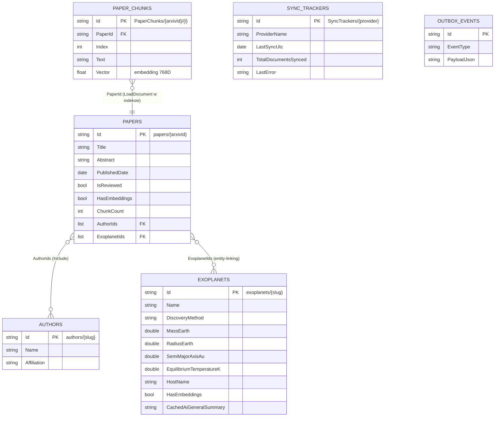

# 5. Diagramy i przykłady RQL

## 5.1. Schemat ER kolekcji

Diagram relacji między kolekcjami (renderowany jako Mermaid na GitHub):



Wariant ASCII (gdyby Mermaid się nie renderował):

```
            AuthorIds (M:N, Include)
   PAPERS ───────────────────────────► AUTHORS
     │
     │ ExoplanetIds (M:N, entity-linking, LoadDocument)
     ▼
 EXOPLANETS

   PAPERS ◄─────────── PaperId (N:1) ─────────── PAPER_CHUNKS
                                                  (osobne dokumenty z wektorami)

   SYNC_TRACKERS   (samodzielna — stan synchronizacji NASA/arXiv)
   OUTBOX_EVENTS   (samodzielna — zdarzenia czasu rzeczywistego)
```

**Uwagi do relacji:**
- `PAPERS ↔ AUTHORS` — wiele-do-wielu przez `Paper.AuthorIds`; ładowane przez **`Include()`**.
- `PAPERS ↔ EXOPLANETS` — wiele-do-wielu przez `Paper.ExoplanetIds`; powiązanie nadawane przez
  `PaperLinkingWorker` (entity-linking po nazwach).
- `PAPER_CHUNKS → PAPERS` — wiele-do-jednego przez `PaperChunk.PaperId`; indeks `Papers/ByVector`
  używa **`LoadDocument`**, by pobrać `ExoplanetIds` rodzica.

---

## 5.2. Przepływ RAG (od dokumentu do odpowiedzi)

```
 NASA TAP ─► NasaSyncJob ─────────► [Exoplanets]
 arXiv    ─► Harvester    ─────────► [Papers]  (HasEmbeddings = false)
                                        │
                            RavenDB Data Subscription
                                        ▼
                                 EmbeddingWorker
              (pobierz HTML z arXiv → podziel na fragmenty → embeduj w Ollama)
                                        ▼
                              [PaperChunks]  (Text + Vector 768D)
                                        │
                                        ▼  indeksacja (Corax)
                              indeks  Papers/ByVector
                                        ▲
                                        │  vector.search(Vector, embedding(pytanie))
 Pytanie użytkownika ─► embedding (Ollama) ─► retrieval (scope po planecie)
                                        │
                                        ▼
                        kontekst (fragmenty + parametry planety)
                                        ▼
                         LLM (llama3.2:3b) ─► strumieniowa odpowiedź (SignalR)
```

Kluczowe pliki przepływu:
- `Infrastructure/Workers/EmbeddingWorker.cs` — chunkowanie + embedding + zapis `PaperChunks`,
- `Application/Indexes/Papers_ByVector.cs` — indeks wektorowy,
- `Application/Features/Rag/AskExoplanet.cs` — retrieval + generacja (streaming),
- `Application/Features/Planets/Queries/GetPlanetAiSummaryQueryHandler.cs` — profil planety.

---

## 5.3. Przykłady zapytań RQL (RavenDB Studio)

Zapytania do wklejenia w **RavenDB Studio → Documents → Query** (`http://localhost:8080`).
RQL = RavenDB Query Language.

### Odczyt / CRUD
```sql
-- wszystkie planety odkryte tranzytem
from Exoplanets where DiscoveryMethod == "Transit"

-- pojedynczy dokument po identyfikatorze
from Exoplanets where id() == "exoplanets/Kepler-22-b"

-- planety z masą w zakresie (zapytanie dynamiczne → auto-index)
from Exoplanets where MassEarth between 1 and 10
```

### Paging (offset, count)
```sql
-- druga strona po 24 elementy, posortowane po okresie orbitalnym
from Exoplanets order by OrbitalPeriodDays as double limit 24, 24
```

### Sortowanie
```sql
from Exoplanets order by MassEarth as double desc
from Papers order by PublishedDate desc
```

### Full-Text Search (indeks Papers/ByAbstractSearch)
```sql
from index 'Papers/ByAbstractSearch'
where search(Abstract, "atmosphere water habitability")
order by PublishedDate desc
```

### Indeks statyczny z polem wyliczanym (Exoplanets/ByHabitability)
```sql
from index 'Exoplanets/ByHabitability' where IsPotentiallyHabitable == true
```

### Indeks map-reduce (Exoplanets/StatsByDiscoveryMethod)
```sql
from index 'Exoplanets/StatsByDiscoveryMethod' order by Count as long desc
```

### Dokumenty powiązane — Include
```sql
-- pobierz publikację i dołącz jej autorów jednym round-tripem
from Papers
where id() == "papers/2301.12345"
include AuthorIds
```

### Vector Search (indeks Papers/ByVector)
```sql
-- semantyczne wyszukiwanie fragmentów; $vec = wektor zapytania (768D)
from index 'Papers/ByVector'
where vector.search(Vector, $vec)
select PaperId, Text, ChunkIndex

-- z ograniczeniem do publikacji powiązanych z konkretną planetą
from index 'Papers/ByVector'
where ExoplanetIds == "exoplanets/Kepler-22-b"
  and vector.search(Vector, $vec)
```
> Parametr `$vec` ustawia się w Studio w zakładce „Parameters”, np.
> `{ "vec": [0.013, -0.21, ...] }`. W aplikacji embedding pytania liczy `OllamaClient`.

### Modyfikacja masowa — PatchByQuery
```sql
-- oznacz wszystkie publikacje jako zrecenzowane
from Papers update { this.IsReviewed = true; }

-- tylko jeszcze niezrecenzowane (mniejszy zakres)
from Papers where IsReviewed == false update { this.IsReviewed = true; }

-- zresetuj embeddingi (np. po migracji chunków) — z kodu: skrypt JS po stronie serwera
from Papers update { delete this.Chunks; this.HasEmbeddings = false; this.ChunkCount = 0; }
```

### Usuwanie zapytaniem (DeleteByQuery)
```sql
-- usuń osierocone fragmenty danej publikacji
from PaperChunks where PaperId == "papers/2301.12345"
```
(w Studio: zapytanie + przycisk **Delete documents**; w kodzie: `DeleteByQueryOperation`).

### Statystyki / diagnostyka
```sql
-- ile publikacji ma już embeddingi
from Papers where HasEmbeddings == true

-- stan synchronizacji dostawców
from SyncTrackers
```
